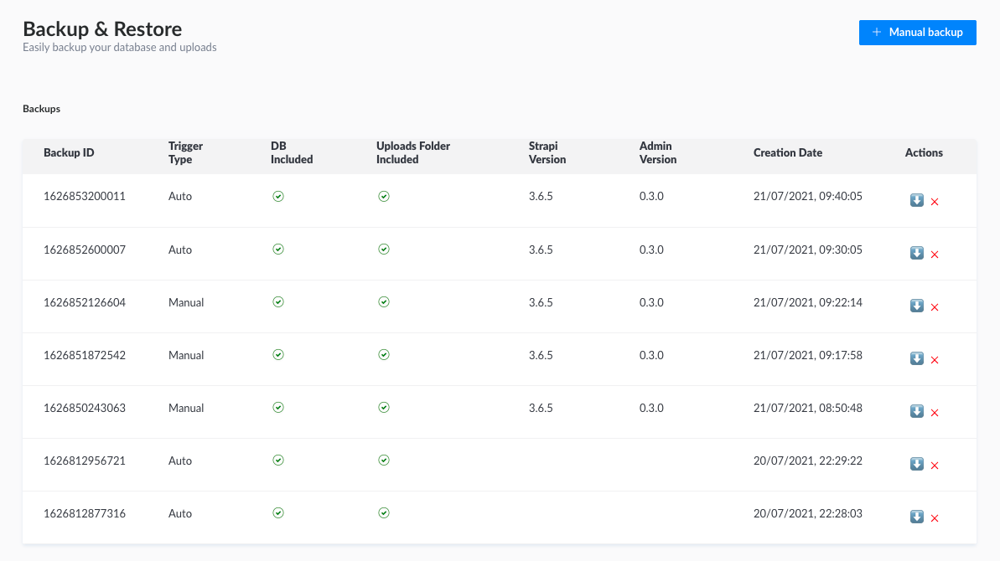

# Strapi Backup & Restore plugin

Add backup and restore features directly inside your strapi admin panel.



Supported databases:
- [x] mysql
- [ ] postgre (should work but not tested)
- [ ] sqlite (should work but not tested)
- [ ] mongodb (not implemented)

## Installation

Install package from npm

```bash
npm i strapi-plugin-backup-restore --save
# or
yarn add strapi-plugin-backup-restore
```

Rebuild your admin ui
```bash
yarn build
# Or launch with admin watch enabled
yarn develop --watch-admin
npm run develop -- --watch-admin 
```

Create a `private/backups` folder. This folder will be used to store your backups.

```bash
mkdir -p private/backups && touch private/backups/.gitkeep
```

You should also add to your `.gitignore` the following:

```
private/backups/*
!private/backups/.gitkeep
```
## Usage
### Manual backup

Navigate to your `admin panel` > `plugins (left sidebar)` > `Backup & Restore`

> Click on `Manual Backup` to trigger a backup.

### Scheduled backup

Edit `config/functions/cron.js` and add the following cron job.

```javascript
module.exports = {
  /**
   * Trigger a backup at 04:00 every day
   */
  "0 4 * * *": async () => {
    console.log("Starting backup from cron...");
    const backupID = Date.now().toString();

    await strapi.plugins["backup-restore"].services["backup-tools"].runBackup(
      backupID,
      false, // Tells if it's a manual backup, well it's not
      true, // Backup database
      true // Backup files
    );
    console.log(`Backup ${backupID} finished`);
  },
};
```

### Backup structure

Your backup contains both database and uploaded files (content of `public/uploads`).
It is a zip file where you'll find:

- database.sql: a full backup of the database used by strapi
- uploads.zip: your uploads folder content

## Roadmap
### Backup
- [x] Backup from mysql 
- [ ] Backup from postgre
- [ ] Backup from sqlite 
- [ ] Backup from mongodb
- [ ] Save backup to remote storage (Google drive, one drive, dropbox...) with a tool like rsync
- [ ] Backup uploads from remote provider

### Restore
- [ ] Restore to mysql 
- [ ] Restore to postgre
- [ ] Restore to sqlite 
- [ ] Restore to mongodb
- [ ] Fetch backup from remote storage (Google drive, one drive, dropbox...) with a tool like rsync
- [ ] Restore uploads to remote provider

## Disclaimer

### MIT license

THE SOFTWARE IS PROVIDED "AS IS", WITHOUT WARRANTY OF ANY KIND, EXPRESS OR IMPLIED, INCLUDING BUT NOT LIMITED TO THE WARRANTIES OF MERCHANTABILITY, FITNESS FOR A PARTICULAR PURPOSE AND NONINFRINGEMENT. IN NO EVENT SHALL THE AUTHORS OR COPYRIGHT HOLDERS BE LIABLE FOR ANY CLAIM, DAMAGES OR OTHER LIABILITY, WHETHER IN AN ACTION OF CONTRACT, TORT OR OTHERWISE, ARISING FROM, OUT OF OR IN CONNECTION WITH THE SOFTWARE OR THE USE OR OTHER DEALINGS IN THE SOFTWARE.

> I (or any contributor) could be responsible for any data loss while using this plugin. Backup feature is quite simple and globally safe (if it fails then you only have a failed backup) but restore is more tricky and external factors involved during the process may break your installation.
### Dependencies
There are not a lot of dump clients available on npm and I was in a hurry when creating this plugin so I picked [mysqldump](https://npmjs.com/package/mysqldump) which has not been updated since june 2020. A better implementation would be to remove that package / contribute to its development.
